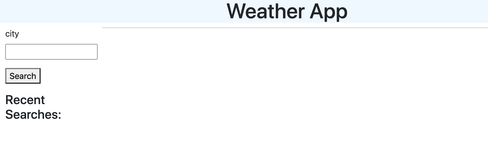
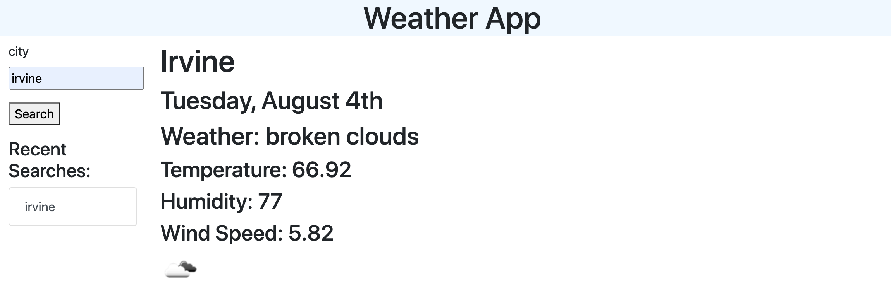
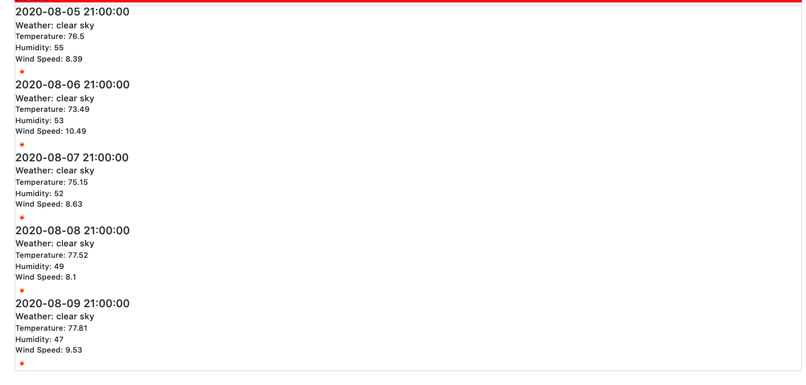
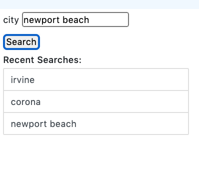

# Weatherboard Dashboard

Created by me: *Danielle Hillman*
Link to deployed application: https://daniellehillman.github.io/weatherdashboard

## Weather
The user is able to input a city. 

Once the city is inputted, the dashboard displays the weather for that current moment including the temperature, humidity, wind speed, and a matching icon. 

The UV index will change from green, yellow, or red depending on the severity of the index.

## Next 5 Days 

Under the current day's weather information, the application displayed the next 5 Days of weather with the same details as the current day.

## Recent Searches

On the left side, once the user inputs a city, it is added to an list that is displayed on the page.

## Future Updating & Additions
Adding lists or rows into each hour time block could allow the user to enter in content in a helpful way. This could be an added tool to this application in the future.